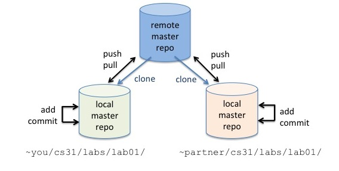
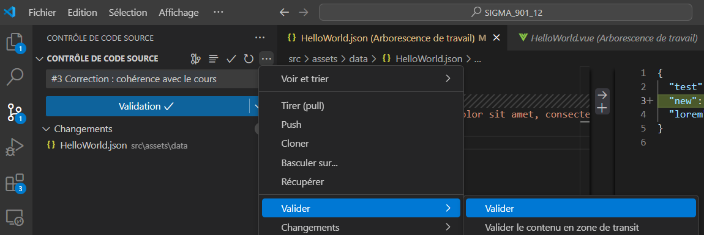
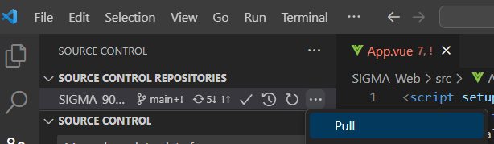
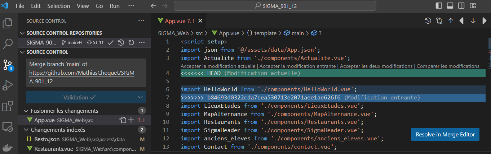
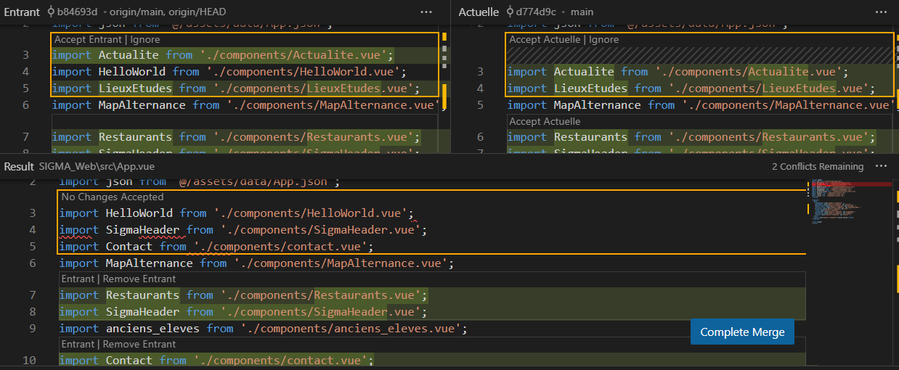
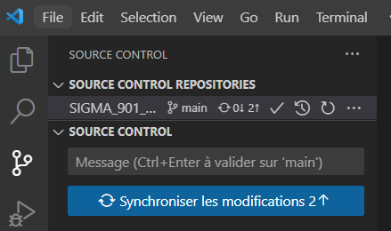
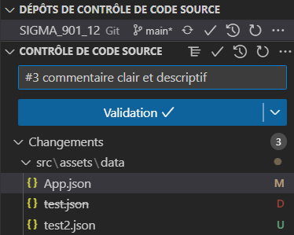
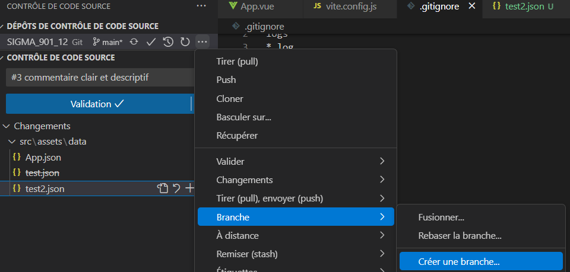
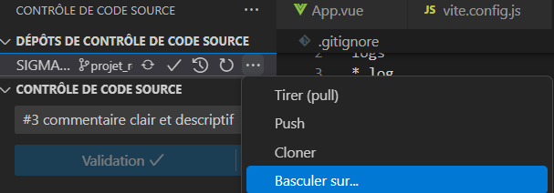
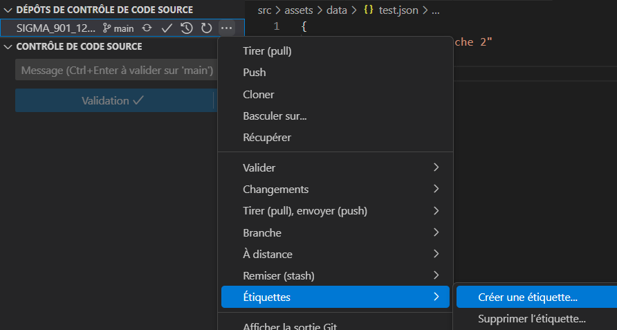

# Introduction à


# Problématiques

- Travailler à plusieurs sur un projet informatique.
- Gérer qui a fait quoi sur les fichiers sources d’un projet :
- Partage du développement entre plusieurs personnes.
- Historique des modifications d’un fichier source.
- Commentaires associés aux évolutions ou corrections
- Outils de visualisation des conflits
- Permet de retrouver rapidement l’origine d’un Bug en cas de régression
- Administrer des projets
  - Qui peut administrer un projet
  - Qui peut modifier ou visualiser les fichiers d’un projet
- Produire et gérer les versions du logiciel
  - Pouvoir ‘versionner’ un logiciel : Sigma v1.2.3 (X.Y.Z)
    - X : version MAJEUR quand il y a des changements non rétrocompatibles
    - Y : version MINEUR quand il y a des ajouts de fonctionnalités rétrocompatibles
    - Z : version de CORRECTIF quand il y a des corrections d’anomalies rétrocompatibles.

# Définition : Gestion de version

- Agit sur une arborescence de fichiers
- Permet de mutualiser un développement
- Permet de stocker toute évolution du code source
- Ajoute une nouvelle dimension au système de fichiers: le temps

# Définition : Git

- Git : crée en 2005 par Linus Torvalds (auteur du noyau Linux)
- Site officiel : https://git-scm.com/
- Wikipedia : https://fr.wikipedia.org/wiki/Git
- Les synonymes
  - Gestion de sources
  - Gestion de configurations
  - Gestion de versions
- Les prédécesseurs
  - 1982 : RCS : Revision Control System
  - 1990 : CSV : Concurrent Versions System
  - 2000 : SVN : Subervsion

# Ressources

- Tutoriels :
  - La documentation de GitHub : https://docs.github.com/en
- Interfaces desktop gratuites pour Git :
  - Plugin vscode (ce que nous allons utiliser)
  - GitHub Desktop (code open-source) : https://desktop.github.com/
  - SourceTree : https://www.sourcetreeapp.com/
  - GitKraken (partiellement gratuit) : https://www.gitkraken.com/

# Premiers pas avec GitHub

- Plateforme de gestion de code source basées sur Git : https://github.com.
- Crée en 2008 et racheté en 2018 par Microsoft pour 7,5 milliards de dollars.
- En 2021, il y avait 18 millions de projets sur GitHub.
- Exemple de projet open-source : QGIS (https://github.com/qgis/QGIS)
- Analyse de la page GitHub QGIS :
  - Panneau de droite : Les versions (releases), les paquetages (packages), Les développeurs (Contributors), Les langages utilisés (Languages)
  - Explorateur de fichiers : ouvrir un fichier et regarder son historique, le travail des développeurs et les commentaires associés aux commits.

# Principes de base

- Extraction du dépôt git existant (git clone).
- Création/modification des fichiers du dépôt en local.
- Si nouveau fichier : ajout du fichier aux dépôt cloné privé local (git add).
- Validation (git commit) des modifications apportées à vos copies clonées privées
  locales (un commentaire est à ajouter au commit pour expliquer les modifications)
- Partage des modifications locales à vos partenaires en les poussant vers le dépôt principal (git push).
- Récupération des modifications effectuées par vos partenaires (git pull). Cette commande combine deux opérations :
  - Récupération propre (git fetch)
  - Fusion des modifications avec la copie locale (git merge)



# Mise en pratique

- Pour les opérations Git :
  - Utilisation en ligne de commandes.
  - Utilisation du plugin intégré à Microsoft vs code.
- Récupération du projet dans un dépôt local (git clone) : https://github.com/MathiasChoquet/SIGMA_901_12

- Périmètre : Pour cette introduction, nous n’allons pas évoqué les branches dans le but de ne pas trop complexifier l’apprentissage. Cet exemple travaille sur la branche principale (main) et va faire toutes ces opérations dessus. Par défaut, c’est la branche principale qui est utilisée pour les opérations Git (ceux qui connaissent ou qui veulent s’entrainer peuvent travailler dans des branches).

# Git : le clone

- Pour démarrer le projet on extrait le dépôt distant et on le clone dans un dépôt local :
  - Dans la fenêtre principale :
    - raccourcis clavier « Ctrl + shit + P » puis Taper « clone »
    - Sélectionner « « cloner à partir de github »
    - Entrer l’URL (l’adresse) du dépôt pour une connexion https : https://github.com/MathiasChoquet/SIGMA_901_12 puis entrer votre user/password GitHub.
- Pour configurer votre Git pour les futurs « commits » : Dans le terminal vscode, taper :

```bash
  git config --global user.name VotreNomUtilisateur
  git config --global user.email VotreEmail@example.com
```

NB : Il est possible (et plus sécurisé) d’utiliser un système de clé publique/privée basée sur le protocole SSH pour cloner son dépôt (tutoriel : ici)

# Git : commit

- Faire un commit (enregistrement dans le dépôt local) :
  - Aller dans le menu de contrôle de source.
  - Ecrire un message clair qui décrit votre commit (Attention à la langue employée). Si votre commit est rattaché à une carte de projet : ajouter #{n° carte} (ex: #3).
  - Clic droit sur les ‘…’ à droite du dépôt -> menu commit -> commit.


NB : La commande git est : git commit –m « #3 Correction : cohérence avec le cours ».

# Git : pull (fetch & merge)

- Synchroniser le dépôt local avec le dépôt distant (git pull -> git fetch & git merge)
- Clic droit sur les ‘…’ à droite du dépôt -> menu pull :
- Récupération des données du serveur distant (fetch).
- Tentative de fusion automatique des modifications (merge).


NB : La commande git est : git pull ou get fetch et git merge.

# Git : pull (fetch & merge)

- Si la fusion automatique n’est pas possible, il faut faire une fusion manuelle :
- Le menu « Fusionner les changements » : indique les fichiers à fusionner. manuellement : cliquer sur chaque fichier et cliquer sur le bouton « Resolve in Merge Editor ».
- Le menu « Changements indexés » indique les fichiers qui vont être fusionner automatiquement.



# Git : pull (fetch & merge)

- Pour chaque fichier à fusionner :
  - Dans l’outil de fusion : Faire la fusion (Accepter à gauche: le dépôt distant ou à droite dépôt local) et cliquer sur le bouton « Complete Merge ».
  - Une fois la fusion effectuée il faut la « commiter » (laisser le commentaire prédéfinis) en appuyant sur validation.



# Git : push

- Maintenant que le dépôt local est synchronisé et éventuellement fusionné, il est possible d’envoyer les modifications sur le dépôt distant.
- Cliquer sur le bouton « Synchroniser les modifications » (le nombre de modifications représentent tous les commits. effectués, et les fusions manuelles).
- Pas de messages sur les push.

!!! Recommandations !!!

- Toujours envoyer (push) du code qui s’exécute correctement : Tester votre code avant !!!
- Les erreurs courantes sont :
  - Fichiers ajoutés en local et non ajoutés avec git (très peu courant avec un IDE).
  - Pas de tests après une fusion manuelle.
- Petite modification de dernière minute qu’on pense sans impact.


NB : La commande git est : git push

# Git : bonnes pratiques avant le commit

- Il est très important de bien analyser les modifications réalisées en local avant de valider son commit.
- Sur vscode le comportement par défaut est d’ajouter les nouveaux fichiers au dépôt de manière automatique.

- Lors du commit on voit :
  - Les nouveaux fichiers avec la lettre ‘U’ pour Unfollowed.
  - Les fichiers supprimés avec la lettre ‘D’ pour Delete.
  - Les fichiers modifiés avec la lettre ‘M’ pour Modified.
    
    NB : La commande git est : git push

NB 1 : Un outil de visualisation des branches est disponible depuis la version 1.92 de vscode sortie en aout 2024. https://code.visualstudio.com/updates/v1_92
NB 2: La commande git pour ajouter un fichier est : git add « nom du fichier »

# Git : Le fichier .gitignore

- Fonction : Définit les fichiers ou dossiers que Git doit ignorer.
- Utilité : Empêche des fichiers sensibles, volumineux ou inutiles d'être ajoutés au dépôt.
- Emplacement : Le fichier .gitignore principal est placé à la racine du projet. Il est possible de placer des fichiers .gitignore dans l’arborescence afin de limiter les types de fichiers par répertoire (très utile lorsque le projet comprend plusieurs répertoires avec des langages différents).

# Git : Les branches

- Une branche permet de créer une version parallèle du code pour permettre un travail indépendant sur des fonctionnalités ou corrections et pour les réintégrer ensuite dans la ou les ranches principales.
- Dans vscode, le nom de la branche est affiché à droite du nom du dépôt (ici main).

- Fonctionnement sur vscode :
  - On créé d’abord sa branche en local (à partir de la branche actuelle) : … -> Branche -> Créer une Branche
  - Réalisation des évolutions.
  - On « commit » sur sa branche locale.
  - On « push » pour créer cette branche sur le dépôt distant.


NB : Les commandes git pour créer et se placer sur la branche sont : git branch <nom_de_la_branche>, git checkout <nom_de_la_branche>

- Il est parfois nécessaire de travailler en parallèle sur plusieurs branches (corrections sur certaines, évolutions sur d’autres... ). Pour cela, on peut vouloir se déplacer sur plusieurs branches depuis son dépôt local.

- Fonctionnement sur vscode :
  - On bascule sur une branche :
  - … -> Basculer sur
  - Dans le menu, on sélectionne la branche sur laquelle on souhaite travailler :
    - Les « branches » sont déjà présentes sur le dépôt local à une certaine version (représenté par l’ID du dernier commit (exemple : f9859266))
    - Les branches distantes sont sur le dépôt distant : les « origin/\* »


NB : La commande git pour se placer sur une branche est : git checkout <nom_de_la_branche>

- Pour rapatrier les modifications faites dans une branche vers une autre branche (pour cet exemple, nous prendrons l’exemple d’un rapatriement de la branche « evol » vers la branche « main ») :
  - Se placer sur la branche « main » (la branche cible de la fusion) avec la fonction vscode « … -> basculer vers » (git checkout main).
  - Mettre à jour la branche « main » pour être à jour avec le dépôt distant avec la fonction vscode « … -> Tirer (pull) » (git pull origin main).
  - Fusionner la branche « evol » dans la branche « main » avec la fonction vccode « … -> Branche -> Fusionner / sélection de la branche à fusionner » (git merge evol).
  - Révolver les conflits si nécessaires.
  - Finaliser la fusion avec un commit et un push classique sur la branche main.

# Git : Les tags (les étiquettes)

- Un tag est une référence immuable à un commit spécifique.
- Utilisé principalement pour marquer des versions importantes (ex. : v1.0.0, release-2024).

- Rechercher et sélectionnez : Git: Push Tags.


NB : Les commandes git : git tag <nom_du_tag>, git push origin <nom_du_tag>

- Fonctionnement sur vscode : …-> Etiquettes -> Créer une etiquettes…
  - Saisie du nom du tag
  - Il n’existe pas de commande IHM pour pousser le tag. Il faut :
  - Ouvrir la palette de commandes (Ctrl + Shift + P).

# Git : Sécuriser son dépôt

- Pour garantir la sécurité d’un dépôt (surtout de sa branche principale) et éviter les grosses erreurs de corruption du dépôt, il y a la possibilité d’ajouter des règles sur les branches :
  - Sur GitHub (très similaire sur gitlab), Allez dans les paramètres (Settings) du dépôt.
  - Sous Branches, cliquez sur « Add branch protection rule ».
  - Configurez la règle pour la branche main :
    - « Require pull request reviews before merging » (exiger une revue de Pull Request avant fusion) : C’est l’administrateur du dépôt qui sera le seul alloué à accepter les fusions via des pull requests.
    - « Require status checks to pass before merging » (S’il y a des tests d’intégrations continues dans le dépôt, ces tests doivent être OK pour que le merge soit autorisé).
    - « Restrict who can push to matching branches » (restreindre les pushs directs sur « main » pour qu’il n’y ait que des Pull Request).
